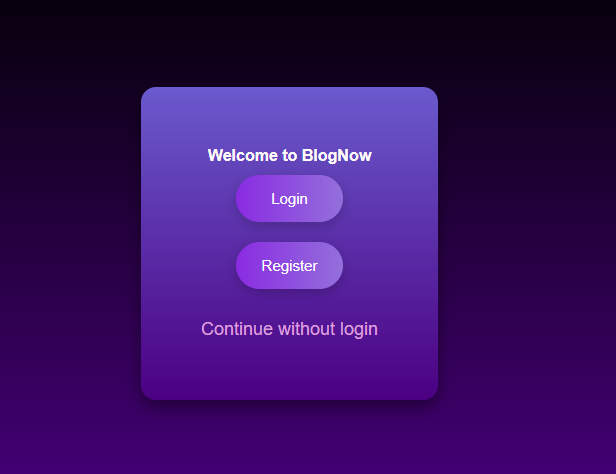

# BlogNow

## 📖 Description

BlogNow is a simple blog project built with ASP.NET Core MVC. It allows users to create and manage posts

## 🚀 Technologies
  
- ASP.NET Core MVC
- Entity Framework Core
- MySQL
- Identity
- C#

## 🎯 Features

- User Authentication – Register, login, and secure access using authentication.
- Create & Manage Posts – Create, and delete blog posts.
- Likes – Like and unlike posts.
- User Profiles – View user profiles and follow/unfollow users.
- Search – Search for posts and users.
- Pagination – Data handling with pagination for posts and user lists.

## ⚙ Prerequisites

Install these programs:

- **.NET SDK**
- **MySQL**
- **IDE** (Visual Studio, VSCode, Rider.)
- **Entity Framework Core Tools**

## ⚡ Steps to Run the Project

### 1. Clone the repository

Clone the project to your local environment:

```bash
git clone https://github.com/Dionclei-Pereira/BlogNow.git
```

### 2. Configure database

Create a database and open Program.cs and update the connection string:

 ```C#
 var connection = "server=localhost;userid=root;password=12345678;database=blognow";
```

### 3. Apply migrations

You can use the Entity Framework CLI or the Visual Studio terminal to apply migrations:

```bash
dotnet ef database update
```
```bash
Update-Database
```

### 4. Run the application

You can use your IDE or CLI to run

```bash
dotnet run
```

## 📸 Screenshots




## 📜Author

**Dionclei de Souza Pereira**

[Linkedin](https://www.linkedin.com/in/dionclei-de-souza-pereira-07287726b/)

⭐️ If you like this project, give it a star! 
